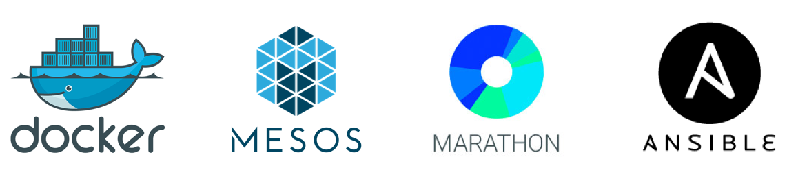
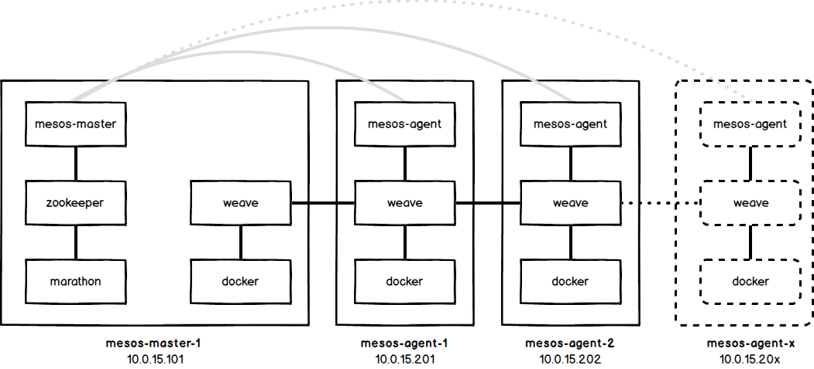
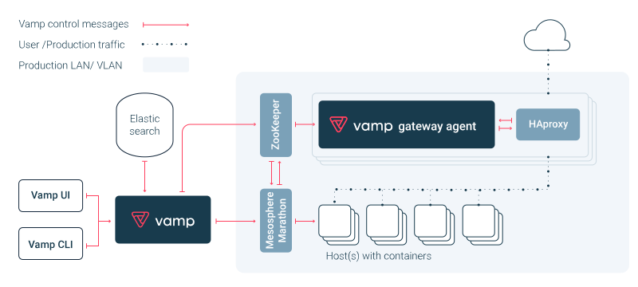

# Mesos/Marathon Playground



The following instructions describe how to bootstrap and use the basic mesosphere environment described by this repository.

### Introduction
In this basic environment, we are running a single management node `mgmt`, which is responsible for provisioning the other nodes through [Ansible](http://ansible.com). There are four other nodes, a mesosphere master node, `mesos-master-1`, two mesosphere agent nodes `mesos-agent-1` and `mesos-agent-2`, as well as a router/load balancer node `lb`.

The `Vagrantfile` is written in such a way that we can easily scale up this environment. If you do so, please don't forget to update the `bootstrap-mgmt.sh` script with the corresponding host entries.

### Step 1: Install prerequisites

- Vagrant 1.8.1+ (https://www.vagrantup.com/downloads.html)
- Vagrant Cachier Plugin 1.2.1+ (`vagrant plugin install vagrant-cachier`)
- VirtualBox 5.1+ (https://www.virtualbox.org)


### Step 2: Start the Cluster Machines

```
$ vagrant up
```
The command may emit an error `==> mgmt: dpkg-preconfigure: unable to re-open stdin: No such file or directory`, which can safely be ignored.

### Step 3: Verify Machines were brought up
A `vagrant status` command should produce the following output when successful.

```
$ vagrant status

Current machine states:
mgmt                      running (virtualbox)
lb                        running (virtualbox)
mesos-master-1            running (virtualbox)
mesos-agent-1             running (virtualbox)
mesos-agent-2             running (virtualbox)

This environment represents multiple VMs. The VMs are all listed
above with their current state. For more information about a specific
VM, run `vagrant status NAME`.
```

We now have 5 'bare-metal' machines as follows:

| IP          | Hostname          | Role |
|-------------|-------------------|------|
| 10.0.15.10  |  mgmt             | Bootstrap Node |
| 10.0.15.11  |  lb               | Router |
| 10.0.15.101 |  mesos-master-1   | Mesos Master and ZooKeeper Master |
| 10.0.15.201 |  mesos-agent-1    | Mesos Agent Node |
| 10.0.15.202 |  mesos-agent-2    | Mesos Agent Node |


### Step 4: Login to Managent Node
We can login to the management node `mgmt` through vagrant.

```
vagrant ssh mgmt
```

We can verify that ansible was installed properly.

```
vagrant@mgmt:~$ ansible --version

ansible 2.2.0.0
  config file = /etc/ansible/ansible.cfg
  configured module search path = Default w/o overrides
```

### Step 5: Prepare nodes for Ansible Provisioning
This environment simulates a production environment as closely as possible. As such we will perform Ansible provisioning as closely to what we would do on a live system (without vagrant) as possible.

1. Collect all nodes SSH Hashes into `.ssh/known_hosts`, using the `ssh-keyscan` command.

```
ssh-keyscan mgmt lb mesos-master-1 mesos-agent-1 mesos-agent-2  >> /home/vagrant/.ssh/known_hosts
```

2. Using the provided `playbooks/provision-mgmt-ssh-key.yml` playbook, we will add the SSH key on the `mgmt` node to the other nodes. The default password setup by Vagrant for user `vagrant` is `vagrant`.

```
vagrant@mgmt:~$ cd /vagrant/ansible

vagrant@mgmt:/vagrant/ansible$ ansible-playbook \
                                playbooks/provision-mgmt-ssh-key.yml \
                                --ask-pass
```

3. Using the provided `playbooks/provision-hosts-file.yml` playbook, we will add a proper template generated hosts file on each node to make sure proper name resolution is working, which is a requirement for correct functioning of mesosphere. Note that we don't have to specify `--ask-pass` this time, as in the previous step we have fully setup Ansible to be run from the `mgmt` node.

```
vagrant@mgmt:/vagrant/ansible$ ansible-playbook playbooks/provision-hosts-file.yml

```

### Step 6: Use Ansible to provision Mesosphere Master and Agent nodes
A simple command will setup the complete infrastructure for us.

```
vagrant@mgmt:/vagrant/ansible$ ansible-playbook site.yml
```

The process will take a while for Ansible to run the playbook, in particular as it has to go and fetch some larger packages (e.g., Oracle Java 8). After a few minutes, Ansible provisioning should finish provisioning.


### Step 7: Verify Mesosphere and Marathon are up and running
You should now be able to access to (assuming you are using the default IP Addresses configured in `Vagrantfile`)

| Component | URL |
|----|----|
| [Mesosphere UI](http://10.0.15.101:5050/#/) | http://10.0.15.101:5050/#/ |
| [Marathon UI](http://10.0.15.101:8080/#/) | http://10.0.15.101:8080/#/ |
| [Chronos UI](http://10.0.15.101:4400) | http://10.0.15.101:4400/ |

The Mesosphere UI should list two agent nodes with some free `CPU` and `Memory` resources. You can schedule a new task through the Marathon UI.

## Day 2 Operations

In the previous part we installed a basic Mesos/Marathon playground. The following sections will take you through deploying a number of components into the playground that make up much of your Day 2 operations.

### Dynamic DNS service
**Mesos-DNS** (http://mesosphere.github.io/mesos-dns/) allows applications and services running on Mesos to find each other through the domain name system (DNS), similarly to how services discover each other throughout the Internet. Applications launched by Marathon or Aurora are assigned names like `search.marathon.mesos` or `log-aggregator.aurora.mesos`. Mesos-DNS translates these names to the IP address and port on the machine currently running each application. To connect to an application in the Mesos cluster, all you need to know is its name. Every time a connection is initiated, the DNS translation will point to the right node in the cluster.

This repository includes a playbook to deploy Mesos-DNS in the cluster. On the `mgmt` node run:
```
vagrant@mgmt:/vagrant/ansible$ ansible-playbook playbooks/deploy-mesos-dns.yml
```

### Overlay network
**Weave Net** (https://www.weave.works/docs/net/latest/introducing-weave/) creates a virtual network that connects Docker containers across multiple hosts and enables their automatic discovery. With Weave Net, portable microservices-based applications consisting of multiple containers can run anywhere: on one host, multiple hosts or even across cloud providers and data centers. Applications use the network just as if the containers were all plugged into the same network switch, without having to configure port mappings, ambassadors or links.



Services provided by application containers on the weave network can be exposed to the outside world, regardless of where they are running. Similarly, existing internal systems can be opened to accept connections from application containers irrespective of their location.

##### Deployment of Weave-Net
This repository includes a playbook to deploy Weave-Net overlay network in the cluster. On the `mgmt` node run:
```
vagrant@mgmt:/vagrant/ansible$ ansible-playbook playbooks/deploy-weave-net.yml
```

##### Testing of Weave-Net
You can test that Weave-Net is working properly by following these steps:
1. deploy the `outyet` app on marathon: `./run-in-marathon.sh outyet.json`
2. Login to any `mesos-agent` node: `vagrant ssh mesos-agent-2`
3. Becoming super-user on the node (to operate docker): `sudo su`
4. Load the weave-net environment such that new containers you start will run on the weave overlay network: `eval $(weave env)`
5. Run a CentOS container: `docker run -ti --rm centos:7`
6. Inside the container querying the `outyet` app (`curl outyet:8080`) should produce the following result:
```
<!DOCTYPE html>
<html><body><center>
	<h2>Is Go 1.4 out yet?</h2>
	<h1>
		<a href="https://go.googlesource.com/go/&#43;/go1.4">YES!</a>
	</h1>
</center></body></html>
```

### Lifecycle Management, A/B Deployments and Canary Testing
**Vamp** (http://vamp.io) is an open source, self-hosted platform for managing (micro-) service oriented architectures that rely on container technology. Vamp provides a DSL to describe services, their dependencies and required runtime environments in blueprints and a runtime/execution engine to deploy these blueprints (similar to AWS Cloudformation). Planned deployments and running services can be managed from your choice of Vamp interface - graphical UI, command line interface or RESTful API.



##### Why Vamp?
Vamp takes care of route updates, metrics collection and service discovery, so you can easily orchestrate complex deployment patterns, such as architecture level A/B testing and canary releases. After deployment, Vamp workflows monitor running applications and can act automatically based on defined SLAs.

##### Compared to other Load Balancers and Gateway Routers
Vamp adds programmable routing (percentage and condition based) and load balancing to the battle-tested HAProxy proxy, as well as a REST API, graphical UI and CLI. This means you can use Vamp together with all common container-schedulers to provide continuous delivery and auto-scaling features using automatic load balancing and clustering of scaled out container instances. By default Vamp is packaged with HAProxy, but you could also integrate the Vamp magic with other programmable proxies such as NGINX, linkerd or Traefik.

##### Deployment
The Vagrant file in this repository by default defines a single North-South load balancer node, called `ext-vga-int-1`. This node corresponds to the Vamp Gateway Agent and HAProxy node described in the architecture diagram above. This repository also includes two marathon files describing deployments of a Vamp compatible Elasticsearch image and the Vamp service coordinator image.

1. Bring the Elasticsearch image up: `./run-in-marathon.sh vamp-elastic.json`
2. Deploy the Vamp service coordinator: `./run-in-marathon.sh vamp-vamp.json`
